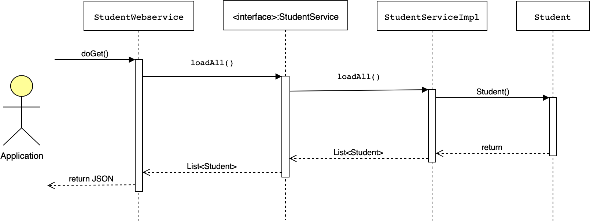
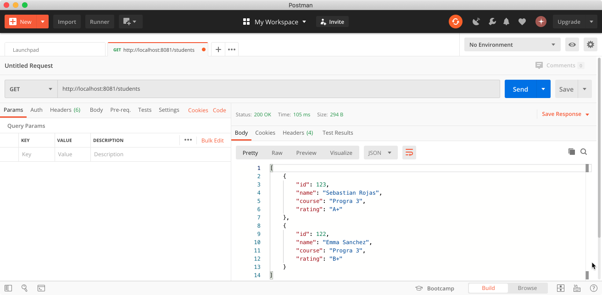

# Ejemplo sencillo de un Webservice
El siguiente ejemplo muestra los conceptos básicos de un web service hecho con servlet de Java.

## Diagrama de secuencia



## Dependencias

- Java
- Jetty Server
- Gradle
  - java -> Plug-in de java
  - war -> Para empaquetar la aplicación en un WAR (Web Application Resource or Web application Archive)
  - gretty -> Plug-in de Gradle para levantar servidores

## Configuración de Gradle

```groovy
plugins {
    id 'java'
    id 'war'
    id "org.gretty" version "3.0.2"
}

group 'ac.cr.una'
version '1.0-SNAPSHOT'

repositories {
    jcenter()
    mavenCentral()
}

dependencies {
    compile 'com.fasterxml.jackson.core:jackson-core:2.6.3'
    compile 'com.fasterxml.jackson.core:jackson-annotations:2.6.3'
    compile 'com.fasterxml.jackson.core:jackson-databind:2.6.3'
    providedCompile group: 'javax.servlet', name: 'javax.servlet-api', version: '4.0.1'
    testCompile group: 'junit', name: 'junit', version: '4.12'
}

gretty {
    httpPort = 8081
    contextPath = '/'
}
```

## Probar el ejemplo

- Para levantar el servidor con la aplicación desde consola utilizando Gradle: `gradlew apprun`

### Resultados

- http://localhost:8081/students

#### GET



